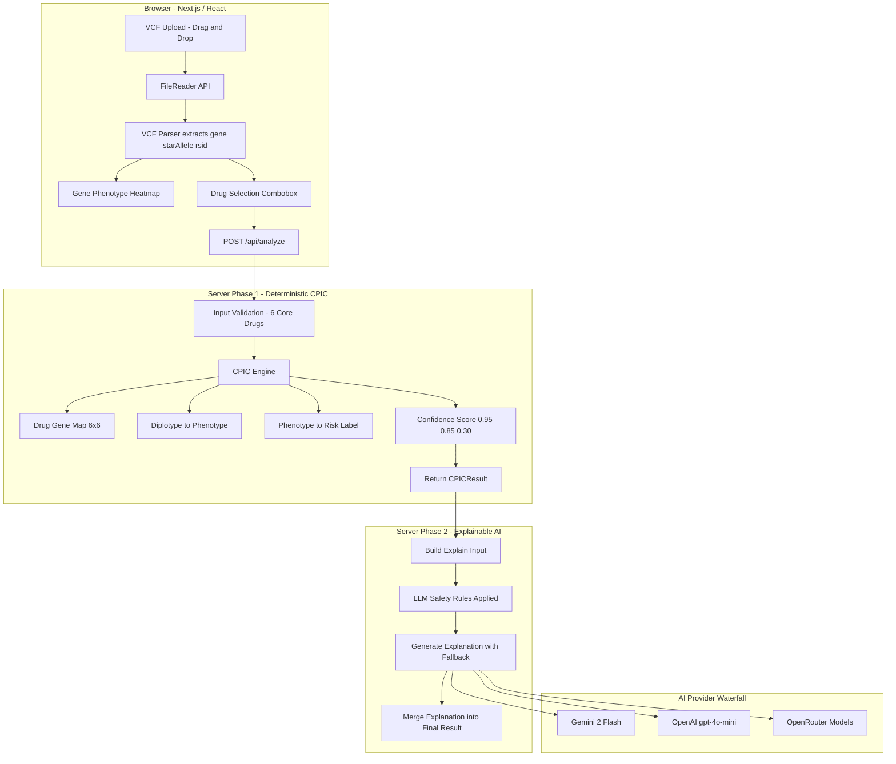

# PharmaGuard — Pharmacogenomic Risk Prediction System

> RIFT 2026 Hackathon · Pharmacogenomics / Explainable AI Track

PharmaGuard is a Next.js web app that analyzes a patient's genetic data (VCF file) plus one or more drugs and returns a pharmacogenomic risk report driven by deterministic CPIC lookup tables, with tightly constrained LLM-generated clinical explanations.

---

## Links

| | |
|---|---|
| **Live Demo** | https://photonx-rift-2026.vercel.app |
| **Demo Video (LinkedIn)** | _Add public LinkedIn post URL here once recorded_ |
| **GitHub** | https://github.com/MonisMS/photonx-rift-2026 |

---

## Problem Alignment (RIFT 2026 PS)

This project is built specifically for the **RIFT 2026 – Pharmacogenomics / Explainable AI** problem statement:

- **Authentic VCF parsing** — parses standard VCF v4.2 files in the browser using the `GENE`, `STAR`, and `RS` INFO tags.
- **6 critical genes** — supports `CYP2D6`, `CYP2C19`, `CYP2C9`, `SLCO1B1`, `TPMT`, `DPYD`.
- **Drug-specific risk prediction** — for the 6 required drugs:
  - `CODEINE`, `WARFARIN`, `CLOPIDOGREL`, `SIMVASTATIN`, `AZATHIOPRINE`, `FLUOROURACIL`.
- **Risk labels** — always one of: `Safe`, `Adjust Dosage`, `Toxic`, `Ineffective`, `Unknown`.
- **JSON schema** — server output matches the exact schema in the problem statement and adds a machine-readable `decision_trace` for auditability.
- **Explainability** — Phase 2 uses an LLM to generate:
  - `summary`, `mechanism`, `recommendation`, `citations` fields under `llm_generated_explanation`.
  - Citations are constructed deterministically from the CPIC guideline reference and real rsIDs.

---

## What It Does

From a clinician's perspective:

1. Upload a patient's `.vcf` file (max 5 MB) via drag-and-drop or file picker.
2. Enter a **Patient ID**.
3. Select one or more drugs (including the 6 core drugs) using a searchable combobox that supports comma‑ or space‑separated input.
4. Click **Run Clinical Risk Analysis**.
5. Instantly see CPIC-based risk cards for each drug (no AI involved).
6. Within ~2–3 seconds per drug, see AI explanations fill in (summary, mechanism, recommendation, citations).
7. Download a clinical PDF report, export structured JSON, or copy JSON to the clipboard.

Core pharmacogenes: `CYP2D6`, `CYP2C19`, `CYP2C9`, `SLCO1B1`, `TPMT`, `DPYD`.

Core risk-engine drugs (required by PS):

- `CODEINE`
- `WARFARIN`
- `CLOPIDOGREL`
- `SIMVASTATIN`
- `AZATHIOPRINE`
- `FLUOROURACIL`

The UI drug picker is backed by the CPIC API and can display >160 guideline drugs, but the deterministic risk engine for this hackathon is intentionally scoped to the 6 required drugs above.

---

## Architecture Overview



The **risk assessment is fully deterministic** (table lookup). The LLM is used only for narrative explanation; it never decides Safe vs Toxic.

---

## JSON Output Schema

Every result object matches (and extends) the required schema:

```json
{
  "patient_id": "PATIENT_001",
  "drug": "CODEINE",
  "timestamp": "2026-02-20T10:00:00.000Z",
  "risk_assessment": {
    "risk_label": "Safe",
    "confidence_score": 0.95,
    "severity": "none"
  },
  "pharmacogenomic_profile": {
    "primary_gene": "CYP2D6",
    "diplotype": "*1/*1",
    "phenotype": "NM",
    "detected_variants": [
      {
        "rsid": "rs3892097",
        "gene": "CYP2D6",
        "star_allele": "*4"
      }
    ]
  },
  "clinical_recommendation": {
    "summary": "Standard codeine dosing is appropriate.",
    "action": "Standard codeine dosing is appropriate.",
    "alternative_drugs": [],
    "guideline_reference": "CPIC Guideline for CYP2D6 and Codeine Therapy (2019 Update) — PMID: 31006110"
  },
  "llm_generated_explanation": {
    "summary": "Short, non‑technical summary for clinicians.",
    "mechanism": "1–2 sentences describing how the diplotype and phenotype affect this drug.",
    "recommendation": "Restates the clinical action in plain language.",
    "citations": "CPIC Guideline for CYP2D6 and Codeine Therapy (2019 Update) — PMID: 31006110; rs3892097"
  },
  "quality_metrics": {
    "vcf_parsing_success": true,
    "variants_detected": 1,
    "genes_analyzed": ["CYP2D6"],
    "decision_trace": {
      "lookup_source": "CPIC 2019 CYP2D6-CODEINE Table",
      "phenotype_rule": "NM → standard dosing",
      "evidence_level": "A",
      "classification_type": "deterministic_table_lookup",
      "confidence_reason": "Both alleles explicitly identified in VCF"
    }
  }
}
```

This is exactly the shape expected by the RIFT public test cases, with an additional `decision_trace` to make the algorithm auditable.

---

## Web Interface

### 1. File Upload

- Drag‑and‑drop upload zone with animation, or file picker.
- Accepts `.vcf` files only (VCF v4.2 text files).
- Enforces a **5 MB** size limit with clear help text.
- Parses VCF **client‑side** so the raw file is never sent to the server.

### 2. Drug Input Field

- Searchable combobox backed by `/api/drugs` (CPIC catalog).
- Supports:
  - Typing a single drug and pressing Enter.
  - Comma‑separated or space‑separated entry (e.g. `codeine, warfarin simvastatin`).
  - Brand‑name aliases (e.g. `Plavix` → `CLOPIDOGREL`).
- The server only analyzes the 6 core drugs specified in the problem statement.

### 3. Results Display

- Per‑drug card with:
  - Risk badge: Safe / Adjust Dosage / Toxic / Ineffective / Unknown.
  - Diplotype and phenotype.
  - Confidence bar and score.
  - Expandable panel with AI explanation.
- Comparison table across all selected drugs for quick at‑a‑glance review.
- Export actions:
  - Download JSON (exact schema as above).
  - Copy JSON to clipboard.
  - Download PDF clinical report.

### 4. Error Handling

- Invalid or oversized VCF → clear error message and guidance.
- Unsupported drugs → server‑side validation with human‑readable error.
- AI provider failures → app still returns deterministic CPIC result; explanation falls back gracefully.

---

## API Reference

### `POST /api/analyze`  — Phase 1 (deterministic CPIC engine)

Request body:

```json
{
  "patientId": "PATIENT_001",
  "variants": [
    { "gene": "CYP2D6", "starAllele": "*4", "rsid": "rs3892097" }
  ],
  "drugs": ["CODEINE", "WARFARIN"],
  "genesDetected": ["CYP2D6"]
}
```

Response body:

```json
{
  "results": [
    { "patient_id": "PATIENT_001", "drug": "CODEINE", "timestamp": "...", "risk_assessment": { "risk_label": "Ineffective", "confidence_score": 0.85, "severity": "low" }, "pharmacogenomic_profile": { "primary_gene": "CYP2D6", "diplotype": "*1/*4", "phenotype": "IM", "detected_variants": [ { "rsid": "rs3892097", "gene": "CYP2D6", "star_allele": "*4" } ] }, "clinical_recommendation": { "summary": "...", "action": "...", "alternative_drugs": ["Tramadol", "Morphine"], "guideline_reference": "CPIC Guideline for CYP2D6 and Codeine Therapy (2019 Update) — PMID: 31006110" }, "quality_metrics": { "vcf_parsing_success": true, "variants_detected": 1, "genes_analyzed": ["CYP2D6"], "decision_trace": { "lookup_source": "...", "phenotype_rule": "...", "evidence_level": "A", "classification_type": "deterministic_table_lookup", "confidence_reason": "..." } } }
  ]
}
```

### `POST /api/explain-single` — Phase 2 (primary path)

Request body:

```json
{ "result": { /* one CPICResult from /api/analyze */ } }
```

Response body:

```json
{ "result": { /* same as input, plus llm_generated_explanation */ } }
```

The server fires `/api/explain-single` once per drug in parallel so that explanations stream in as soon as each provider responds.

### `POST /api/explain` — Phase 2 (legacy batch)

Takes `{ "results": CPICResult[] }` and returns `AnalysisResult[]`. Kept for completeness; the UI primarily uses `/api/explain-single`.

### Additional Utility Endpoints

- `GET /api/drugs` — returns the CPIC drug catalog used by the combobox.
- `GET /api/test-keys` — checks configured AI providers / keys.

---

## Local Development

```bash
# Clone the repo
git clone https://github.com/MonisMS/photonx-rift-2026
cd photonx-rift-2026

# Install dependencies (pnpm only)
pnpm install

# Set up environment variables
cp .env.example .env.local
# Fill in at least GOOGLE_API_KEY_1

# Run dev server
pnpm dev

# Run tests once
pnpm test

# Type‑check without building
pnpm tsc --noEmit
```

Open http://localhost:3000 in your browser.

---

## Environment Variables

See `.env.example` for the full list. Key values:

| Variable | Required | Description |
|---|---|---|
| `GOOGLE_API_KEY_1` | Yes | Primary Gemini key — free at https://aistudio.google.com/apikey |
| `GOOGLE_API_KEY_2..4` | No | Extra Gemini keys for rate‑limit rotation (~30 req/day each) |
| `OPENROUTER_API_KEY` | No | Free fallback — Llama / Mistral models via https://openrouter.ai |
| `OPENAI_API_KEY` | No | Paid last resort — gpt‑4o‑mini |

Provider order: **Gemini → OpenAI → OpenRouter**. If all providers fail or are quota‑limited, the app still returns deterministic CPIC results with a safe fallback explanation string.

---

## Risk Labels

| Risk Label | Severity | Meaning |
|---|---|---|
| **Safe** | none | Standard dosing appropriate |
| **Adjust Dosage** | moderate / high | Dose modification or closer monitoring required |
| **Toxic** | high / critical | Avoid this drug — serious toxicity risk |
| **Ineffective** | low / high | Drug unlikely to work at standard doses |
| **Unknown** | none | Insufficient genotype information to classify risk |

Confidence scores:

- 0.95 — both alleles observed or clear reference genotype.
- 0.85 — one allele observed; the other inferred as *1.
- 0.30 — gene not sequenced in the VCF panel.

---

## Hackathon Submission Checklist

This section mirrors the **mandatory submission requirements** from the RIFT 2026 problem statement.

1. **Live deployed web application URL**  
   - Hosted on Vercel: `https://photonx-rift-2026.vercel.app` (update if your production URL changes).

2. **LinkedIn video demonstration (2–5 minutes)**  
   - Public post demonstrating: problem, architecture, live demo, and key learnings.  
   - Tag the official RIFT LinkedIn page.  
   - Include hashtags: `#RIFT2026` `#PharmaGuard` `#Pharmacogenomics` `#AIinHealthcare`.

3. **GitHub repository (this repo)**  
   - Public repository with all source code.  
   - Contains: `package.json`, `.env.example`, deployment instructions, and sample VCFs in `public/samples/`.

4. **README completeness (this file)**  
   - Project title and description.  
   - Live demo URL.  
   - LinkedIn video link (to be filled).  
   - Architecture overview and tech stack.  
   - Installation and usage instructions.  
   - API documentation and JSON schema.  
   - Team members and roles.

Before submitting on the RIFT portal, double‑check that:

- The live app is accessible and functional.  
- The LinkedIn video post is public and tags the RIFT page.  
- This README contains working links for demo, repo, and video.  
- The app accepts `.vcf` uploads and returns JSON in the required shape.

---

## Team

Update this table with your actual team details before submission:

| Name | Role |
|---|---|
| Praphull Kumar Shahi | Lead Developer |
| Syed Monis Sarwar | PGx / Clinical Domain |
| Vibhav Shukla | Product & UX |
| Tripurari Kumar | Documentation & Video |

---

*PharmaGuard · RIFT 2026 · For clinical research and educational use only*
